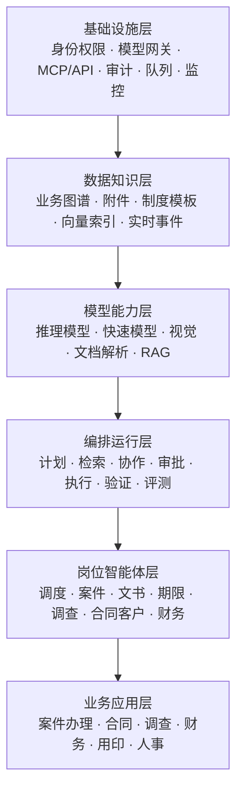
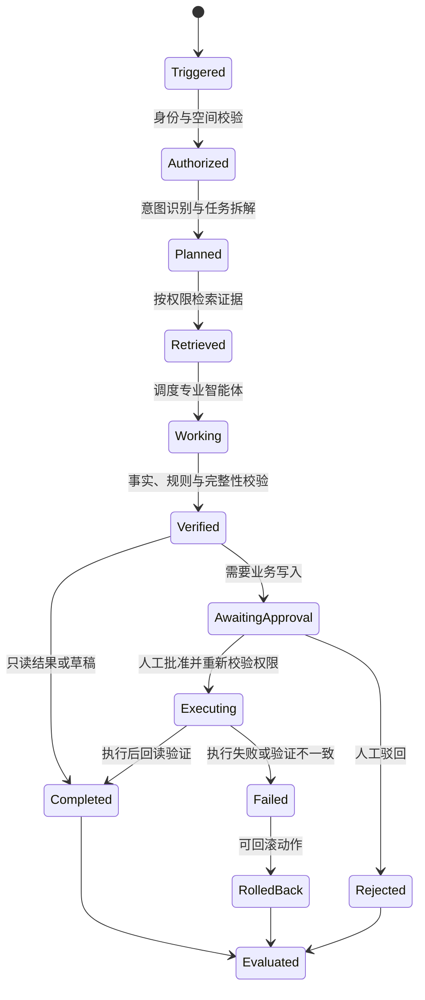

# Sunhold OA 企业智能体架构设计 v1

## 1. 设计目标

Sunhold OA 的智能体中心采用“一个统一入口、多个岗位智能体、一个受控执行平台”的形态。用户仍在一个页面中提问和下达任务，系统在后台根据案件阶段、业务类型、当前身份和风险等级选择专业智能体协作。

目标不是增加聊天功能，而是让智能体在现有权限和审批体系内完成可验证的业务闭环：

`业务触发 → 理解与计划 → 读取授权数据 → 专业智能体协作 → 生成结果或待审批动作 → 人工审批 → 执行与验证 → 审计与反馈`

首要原则：

1. 业务系统是事实来源，模型不能凭空补齐缺失信息。
2. 智能体继承当前用户权限，不能扩大数据范围或操作能力。
3. 读取、分析、生成草稿可以自动完成；正式写入必须经过风险策略和人工审批。
4. 每个结论必须能够追溯到业务记录、附件、制度或模型判断。
5. 每次运行都有状态、耗时、成本、输入来源、执行结果和错误记录。
6. 用户只面对一个智能体中心，后台编排细节按需展示。

## 2. 当前基础与差距

### 2.1 已有能力

当前系统已经具备以下基础：

- 一级菜单“智能体中心”和按案件选择的统一业务空间。
- 案件、客户、合同、调查、线索、财务、任务、期限、附件和人员关系聚合。
- 基于现有账号数据范围和字段权限构造案件上下文。
- LangGraph 会话运行时，按“案件 + 当前用户”隔离会话。
- 流式回答、截图分析、DOCX/PDF 等附件内容读取。
- 通用办公、法律文书、法律简报、PDF 审阅、数据分析、截图证据和安全检查等技能。
- 六类受控操作：案件修改、案件数据修改、任务创建、提醒创建、客户修改和合同修改。
- 操作预览、人工批准/驳回、批准后再次校验当前业务权限。
- PostgreSQL 检查点或内存检查点，可保存会话状态。

### 2.2 关键差距

| 能力 | 当前状态 | 目标状态 |
|---|---|---|
| 任务编排 | 单个 assistant 节点直接回答 | 规划、检索、专业处理、审批、执行、验证组成状态机 |
| 专业协作 | 用户手动选择技能 | 调度智能体按任务自动选择一个或多个岗位智能体 |
| 模型使用 | 单模型、统一参数 | 按任务、风险、时延和成本进行模型路由 |
| 上下文 | 每次聚合并截断完整案件数据 | 先形成业务快照，再按问题检索相关记录和证据 |
| 证据 | 提示模型引用附件 | 结构化保存每条结论的来源定位和可信度 |
| 主动工作 | 用户发消息后运行 | 期限、状态、金额、审批和材料变化可触发任务 |
| 运行治理 | 主要依赖 LangGraph checkpoint | 独立运行台账、步骤日志、动作记录和评测记录 |
| 效果衡量 | 无统一 KPI | 成功率、准确率、采纳率、人工干预率、耗时和成本 |

## 3. 六层目标架构



### 3.1 基础设施层

- 保留 FastAPI、PostgreSQL、LangGraph 和现有前端。
- 增加统一模型网关，隐藏供应商密钥并记录模型、令牌、费用、耗时和错误。
- 所有工具必须注册明确的输入结构、所需权限、风险等级、幂等规则和回滚说明。
- 使用后台任务队列执行长耗时任务，前端通过流式事件查看进度。
- 为每次运行分配 `run_id`，贯穿模型调用、工具调用、审批、数据库操作和日志。
- 会话 checkpoint 负责恢复对话；业务运行台账负责审计，两者不能互相替代。

### 3.2 数据与知识层

建立统一的“业务上下文服务”，对智能体提供四种来源：

1. **结构化业务数据**：案件、客户、合同、调查、线索、财务、用印、任务、期限和人员。
2. **非结构化材料**：DOCX、PDF、图片、邮件、制度、模板和历史文书。
3. **业务关系图**：案件与客户、合同、调查、财务、任务、附件之间的关系。
4. **实时事件**：案件阶段变化、期限临近、审批退回、回款变化和新材料上传。

上下文读取分为两步：

- 首先生成小型业务快照，包含身份、阶段、关系、风险和可用能力。
- 再根据问题检索相关记录、附件段落和制度条款，避免把完整案件一次性塞给模型。

每个检索结果统一返回：`source_type`、`source_id`、`title`、`location`、`content`、`updated_at`、`permission_scope`。回答中的事实结论保存对应的 `source_id + location`。

### 3.3 模型与能力层

模型由路由器选择，不由页面写死：

| 任务类型 | 默认能力 | 路由要求 |
|---|---|---|
| 分类、摘要、字段提取 | 快速低成本模型 | 低温度、结构化输出 |
| 法律分析、复杂计划 | 强推理模型 | 证据充分性检查、较长上下文 |
| 截图、扫描件和票据 | 视觉模型 | 保存页码、区域和识别置信度 |
| 文档检索 | 向量 + 关键词混合检索 | 权限过滤必须在检索前完成 |
| 文书生成 | 文档模型 + 模板引擎 | 模型生成内容，模板引擎控制版式 |

路由优先级：数据安全与能力匹配优先，其次是准确率、响应时间和费用。模型不可用时允许降级到同等级候选模型，但必须向运行台账记录降级原因。

### 3.4 编排与运行层

LangGraph 从单节点扩展为下列状态机：



每一步都输出结构化结果，调度智能体不能通过自由文本直接执行数据库写入。工具执行必须来自经过验证的 `action_request`。

### 3.5 岗位智能体层

用户只看到“Sunhold 智能体”，后台设置七个岗位：

| 智能体 | 职责 | 可读取范围 | 可产生的结果 |
|---|---|---|---|
| 调度智能体 | 识别意图、拆解任务、选择智能体、合并结果 | 当前授权业务快照 | 执行计划、最终答复、审批请求 |
| 案件管理智能体 | 检查阶段、任务、人员、材料和总体风险 | 当前案件空间 | 案件简报、缺口清单、任务/提醒建议 |
| 法律文书智能体 | 基于事实、证据和模板起草文书 | 案件材料与授权模板 | 可编辑草稿、引用清单、待补字段 |
| 期限与流程智能体 | 识别期限、阶段条件和逾期风险 | 案件日期、任务、流程规则 | 期限风险、提醒/任务建议 |
| 调查证据智能体 | 整理调查、线索、截图及证据链 | 授权调查记录和附件 | 证据目录、矛盾点、取证缺口 |
| 合同客户智能体 | 分析合同义务、客户信息和关联事项 | 授权合同与客户数据 | 履约风险、信息修正建议 |
| 财务经营智能体 | 分析费用、应收、回款、发票和退款 | 具备金额字段权限的数据 | 财务摘要、异常、催收建议 |

“技能”继续保留，但改为岗位智能体可以调用的能力包。例如 PDF 审阅是文书或调查智能体的能力，不再要求用户理解后台路由。

### 3.6 业务应用层

第一阶段覆盖当前案件中心；后续依次接入合同中心、调查大厅、财务中心、用印中心和管理驾驶舱。不同模块复用同一运行平台，只更换业务空间类型、权限能力和工具集合。

## 4. 权限、风险与人工审批

现有“读取范围跟随用户、写操作人工审批”的原则继续作为默认策略。

| 等级 | 示例 | 默认处理 |
|---|---|---|
| R0 只读 | 查询、摘要、风险分析 | 自动执行，记录来源 |
| R1 草稿 | 生成文书、邮件或报告草稿 | 自动保存到 AI 草稿空间，用户确认后转正式目录 |
| R2 内部低风险写入 | 创建本人任务、普通提醒 | 第一阶段仍人工确认；运行稳定后可按角色授权 |
| R3 业务状态或主数据 | 修改案件、客户、合同、审批状态 | 必须由有权用户批准，批准时重新校验权限和版本 |
| R4 财务及高风险 | 付款、退款、开票、删除、权限变更、对外发送 | 双重校验；关键操作采用双人审批，智能体不得自行批准 |

审批卡必须显示：业务对象、修改前、修改后、依据来源、风险等级、影响范围、是否可回滚、请求人、审批人和有效期限。审批通过前后都校验记录版本，防止旧建议覆盖新数据。

## 5. 运行数据模型

建议增加独立表，而不是把关键状态只放在 checkpoint：

| 表 | 用途 |
|---|---|
| `agent_profiles` | 岗位智能体定义、职责、允许技能和默认模型策略 |
| `agent_runs` | 一次业务任务的状态、用户、空间、触发方式、耗时、费用和结果 |
| `agent_steps` | 计划、检索、模型、工具、验证等每一步的输入摘要和结果 |
| `agent_evidence_refs` | 结论到业务记录、附件页码、制度条款的引用关系 |
| `agent_action_requests` | 待审批动作、风险、版本、审批状态和执行结果 |
| `agent_audit_events` | 不可变的运行、审批、执行、失败和回滚事件 |
| `agent_evaluations` | 用户反馈、规则评测、事实一致性和业务结果指标 |
| `agent_triggers` | 定时或事件触发条件、作用范围、启停状态和责任人 |
| `model_routes` | 任务类型到模型候选、成本上限、超时和降级策略 |

长期记忆只保存经过确认的偏好、规则和工作经验，并按组织、角色、用户和业务空间分层。聊天内容不能自动升级为企业事实。

## 6. 工具与动作目录

保留当前六类动作，并逐步增加经过业务 API 封装的工具：

- 案件：分配人员、创建任务、创建提醒、更新基础信息、推进受控阶段。
- 文档：创建草稿、套用模板、生成预览、确认后归入正式目录。
- 调查：创建调查任务、关联线索、补充证据目录。
- 合同客户：创建跟进任务、生成修正申请、检查合同履约节点。
- 财务：生成应收提醒、退款/付款申请草稿；不允许直接支付。
- 用印：生成用印申请草稿并进入原审批流程。
- 通知：生成站内通知或钉钉消息草稿，对外发送前确认接收人和内容。

每个工具采用统一契约：

```json
{
  "name": "case.task.create",
  "required_capability": "can_create_case_task",
  "risk_level": "R2",
  "input_schema": {},
  "idempotency_key": "run_id + step_id",
  "approval_policy": "explicit_user_confirmation",
  "verification": "创建后按记录 ID 回读",
  "rollback": "未开始任务可撤回"
}
```

## 7. 智能体中心界面

继续沿用当前页面骨架，并调整为三个工作区：

1. **左侧业务空间**：案件搜索、我的待办、风险空间和最近空间。
2. **中间任务时间线**：用户指令、执行计划、正在运行的步骤、智能体结果和审批卡。
3. **右侧依据与动作**：引用的业务数据/附件页、待补信息、待审批动作和运行详情。

默认只显示用户需要理解的步骤。用户展开“运行详情”后，才能看到使用了哪些岗位智能体、工具、模型、耗时和证据来源。顶部阶段条继续显示案件流程，并允许从风险项直接发起对应任务。

## 8. 主动触发设计

第一批仅启用提醒型触发，不自动写业务数据：

- 案件期限临近或逾期。
- 标准阶段必备材料缺失。
- 任务长期未更新或负责人为空。
- 合同应收即将到期、已逾期或回款异常。
- 审批被退回后超过设定时间未处理。
- 新附件上传后发现关键字段矛盾。

触发后创建一条智能体任务，责任人可以查看依据、接受建议、转为业务任务或忽略。系统记录处理结果，用于调整规则。

## 9. 评测与运营指标

上线前建立固定脱敏测试集，覆盖查询、材料审阅、期限、文书、权限拒绝、审批和故障恢复。生产环境记录以下指标：

- 任务完成率和首次成功率。
- 事实引用覆盖率、引用正确率和缺失信息识别率。
- 建议采纳率、审批通过率和人工修改比例。
- 越权拦截率、误拦截率、执行失败率和回滚率。
- 首字响应时间、总耗时、模型令牌和单任务成本。
- 用户停止生成、重试和负面反馈次数。

模型或提示词升级只有在固定评测集不退化、权限测试通过且成本在阈值内时才能发布。

## 10. 实施顺序

### P0：把当前单智能体做成可靠运行平台

- 建立 `agent_runs`、`agent_steps`、`agent_action_requests`、`agent_audit_events`。
- 所有调用增加 `run_id`、状态、超时、取消、重试和错误分类。
- 将审批动作从 checkpoint 状态迁入业务表，checkpoint 仅保存会话。
- 增加证据引用结构和回答依据面板。
- 建立模型网关和基础模型路由。

验收标准：服务重启后审批动作不丢失；每次回答可以查看依据；每次动作可以追踪到请求、审批、执行和回读结果。

### P1：加入岗位智能体与自动编排

- 增加调度、案件、文书、期限、调查、合同客户和财务智能体。
- 将现有技能改为岗位智能体调用的能力包。
- 建立规划、检索、专业处理、验证和汇总节点。
- 前端增加任务时间线与依据面板。

验收标准：一个跨模块问题可以由多个岗位智能体协作完成，用户无需手动切换技能，结果不重复且来源明确。

### P2：接入主动业务事件

- 建立期限、材料、任务、回款和审批退回触发器。
- 增加智能体任务收件箱、负责人和处理状态。
- 所有主动任务默认只生成建议，不直接修改业务数据。

验收标准：触发条件可解释、可关闭、可去重，不重复制造提醒；处理结果能够反馈给规则。

### P3：扩大执行范围并持续优化

- 按实际通过率逐项开放 R2 自动执行策略。
- 接入语音转写、语音播报和更多业务空间。
- 建立管理员智能体运营台、成本预算、模型效果对比和版本回滚。

验收标准：每项自动化都有责任人、风险阈值、效果指标和关闭开关。

## 11. 第一开发批次

建议下一次开发只做 P0，不立即铺开七个智能体。第一批包含：

1. 新建持久化运行台账、审批动作表和审计事件表。
2. 把当前六类动作迁入统一工具注册表。
3. 回答增加结构化引用，前端可打开对应业务记录或附件页。
4. 增加运行状态、取消、超时和失败原因展示。
5. 建立模型路由接口，但先继续使用当前生产模型作为唯一候选。
6. 保留当前智能体中心入口和交互，完成底层迁移后再开发多智能体编排。

这样可以先解决可靠性、可追踪和可恢复问题，同时避免一次重写导致现有智能体不可用。

## 12. 明确不采用的设计

- 不允许模型直接拼 SQL 或绕过业务 API 写数据库。
- 不按模型名称创建多个用户可见的聊天机器人。
- 不把整个数据库或所有附件无差别发送给模型。
- 不把模型回答当成已经确认的业务事实。
- 不允许智能体审批自己发起的高风险动作。
- 不用 checkpoint 代替正式审批记录和审计日志。

## 13. 与现有代码的落点

| 当前模块 | 后续职责 |
|---|---|
| `app/case_agent.py` | 拆分为运行时、编排图、模型网关、状态转换和公开事件协议 |
| `app/agent_skills.py` | 作为能力包注册表，增加输入输出和适用岗位元数据 |
| `areas/legal/router.py` 案件空间接口 | 保留业务上下文入口，内部改调业务上下文服务和检索服务 |
| `core/documents.py` 动作执行 | 迁移到统一工具执行器，保留现有业务权限校验函数 |
| `AgentCenterPage.tsx` | 保留入口，拆分业务空间列表、任务时间线、依据面板和审批面板 |
| LangGraph checkpoint | 继续保存可恢复的会话与图状态，不保存唯一业务审批事实 |

本设计基于当前 `v1.1.74` 代码基线，只定义目标结构和实施边界，不包含数据库迁移或生产功能变更。
