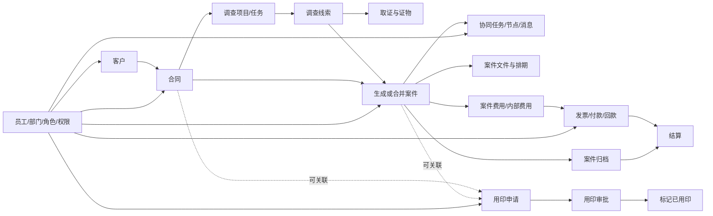
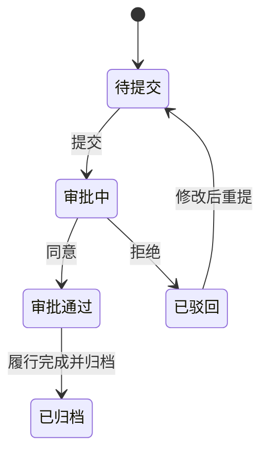
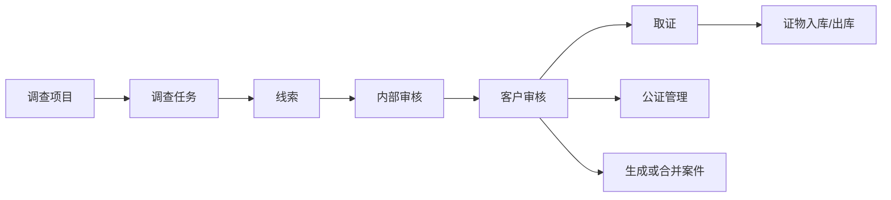
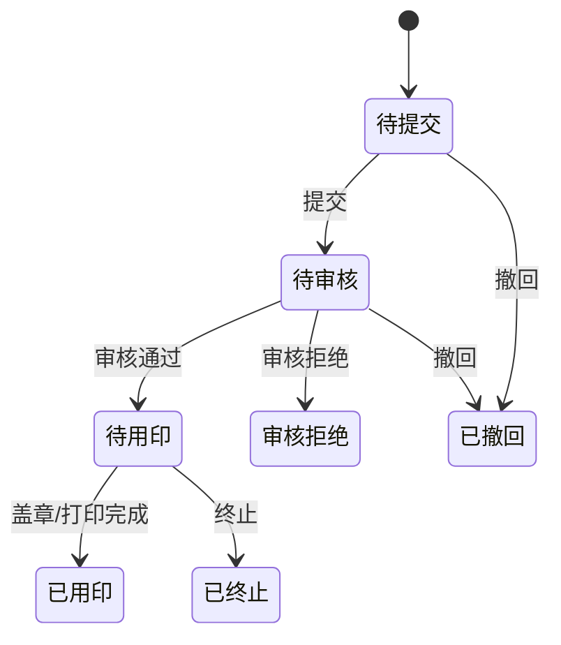

# 原 OA 系统业务逻辑总览

更新时间：2026-07-17

## 1. 结论

原 OA 不是一套彼此独立的菜单页面，而是以“客户、合同、案件”为主业务轴，以“调查取证、协同任务、用印、文件、财务、归档”为受控生命周期，以“员工、部门、角色、权限、日志”为治理底座的律师事务所协作系统。

业务主链如下：

特别确认：**用印是独立模块**。它拥有独立编号、状态、审批记录、附件及打印/用印状态，只是可以选择关联合同或案件，不能并入“调查与取证”流程。

## 2. 证据范围

本次盘点采用四层证据交叉核对：

1. 页面层：原 MVC 的 Razor 页面、按钮文案、列表和表单。
2. 控制器层：1,349 个 MVC Action，确认页面入口和业务操作。
3. 程序集层：8 个一方业务程序集，提取 2,264 个类型、20,289 个方法及 1,208 个枚举值。
4. 数据层：生产数据库只读元数据和聚合状态，共 253 张表、4,141 个字段、16 个视图、124 个存储过程、334 个索引和 201 组状态分布。

数据库没有声明外键，说明实体关联主要由应用服务、编号字段和业务流程维护。重构时不能仅照抄表结构，必须在 FastAPI 服务层和 PostgreSQL 约束层补足关联完整性。

本次没有复制客户姓名、案情、附件内容等业务明细；没有修改原系统业务数据。

## 3. 模块关系总表

| 模块 | 页面/控制器证据 | 核心数据 | 主要生命周期 | 上下游关系 |
|---|---|---|---|---|
| 客户管理 | `CRM/Customer`、联系人、共享、分配、沟通、附件 | `CRM_Customer` 等 | 建档→分配→联系/共享→签约；删除进入回收站，恢复或进入公海 | 为合同、案件、调查、用印、发票提供主体 |
| 合同中心 | `CMS/FCM Contract`、Draft、Audit、Archive、File、Payment | `FCM_Contract` 等 | 草稿→待提交→审批中→通过/驳回→履行→归档 | 上接客户，下接案件、用印和财务 |
| 案件中心 | `Legal/Case`、CaseList、CaseFile、CaseTask、CaseArchive | `Legal_Case` 等 | 建案→补全当事人/司法机关→分配律师→阶段推进→结案归档 | 连接合同、线索、任务、文件、财务和用印 |
| 协同任务 | `TP/Task`、TaskNode、TaskMessage、TaskFile | `Legal_Case_Task*` | 发起→处理→节点协作→交接/拒绝/停止/撤回→完成→验收/重启 | 通常挂接案件，支持多人协作 |
| 调查与取证 | `CIT/Investigation*` | `Legal_Investigation*` | 立项→调查任务→线索→内部审核→客户审核→取证→证物流转→转案件 | 上接合同/客户，下接案件、公证、证物和费用 |
| 用印管理 | `AWS/OfficialDocument*` | `AWS_OfficialDocument*` | 申请→审核→待用印→已用印；可拒绝、撤回、终止 | 独立模块，可选关联合同或案件 |
| 财务中心 | `FAM/FAS/FSC` 的 AR、AP、InternalFee、Invoice、Settlement | `FAM_*` | 费用→请款/应收→审批→开票/付款→回款→结算→归档结算 | 与客户、合同、案件和银行流水联动 |
| 人事与权限 | `HR/Staff`、Department、Role；`System/User` | `HR_*`、`SYS_*` | 员工→账号→部门/角色→菜单和数据范围→离岗停用 | 为所有模块提供人员、审批人与权限 |
| 仓库与证物 | `WMS/Warehouse*`、CIT 证据 | `WMS_*`、证据表 | 未入库→已入库→待领取→出库→重新入库/销毁 | 证物来自调查线索 |
| 控制台与报表 | `RPT`、控制台聚合页 | 跨模块视图/聚合 | 只读汇总和钻取 | 不应成为独立业务真相 |

完整可筛选版本见 `analysis/业务模块页面代码数据库对应表.csv`。

## 4. 核心业务流程

### 4.1 客户生命周期

页面动作包括客户列表、公海、创建/编辑、查看、删除、恢复、打开、关闭和利益冲突查询。控制器明确存在 `CustomerCreateUpdate`、`CustomerDelete`、`CustomerRestore`、`CustomerOpen`、`CustomerClose` 和 `CustomerQuery`。

业务逻辑：

1. 客户先建档并分配客户管理人。
2. 联系人、沟通记录、附件和共享是客户的附属信息。
3. 客户可以进入合同和案件，但不能绕过客户可见范围直接取得其业务数据。
4. “删除”按业务语义进入回收站，不等同物理删除；可以恢复或释放到公海。
5. 利益冲突检索以企业主体及其历史案件关系为依据。

数据现状：`CRM_Customer` 16,948 条，其中启用 16,914 条、停用 34 条；共享 38 条。

### 4.2 合同生命周期

页面和控制器按草稿、待审批、审批通过、驳回、总账和归档分区。关键动作包括 `DraftCreate`、`ToAudit`、`ContractAuditCreate`、`Archived`、合同对象和合同文件管理。

状态枚举：1 待提交、2 审批中、3 审批通过、4 已驳回、5 已归档。

数据现状：705 份合同，其中待提交 95、审批中 266、审批通过 302、驳回 13、归档 29。

合同是客户向案件、用印和财务延伸的关键边界。建案、用印和开票均应校验合同状态和当前用户可见范围。

### 4.3 案件生命周期

案件页面支持新建、基本信息、当事人、公安/检察院/法院、承办律师、阶段、执行状态、结算金额、公证号、线索转案件、合并、删除、文件、排期和归档。

主要业务顺序：

1. 从合格合同直接建案，或由审核通过的调查线索生成/合并案件。
2. 按案件类型补录当事人和司法机关；刑事、行政、国家赔偿、顾问、仲裁等字段分支不同。
3. 分配承办律师、经办律师和助理，进入案件阶段推进。
4. 案件期间产生任务、文件、开庭排期、费用、发票和用印申请。
5. 结案后提交归档；归档审核不能被通用记录接口绕过。

案件归档状态：5 待提交、7 待内部审核、10 待审核、20 审核通过、30 审核拒绝。

执行状态覆盖一审/二审待执行、准备材料、提交法院、执行受理、中止、结案、终本、终结、亏损、异议和和解中。

数据现状：案件 10,689 件；案件文件 161,178 条；归档通过 5,684 件，待审核 563 件，待内部审核 188 件，拒绝 142 件，另有 4,112 件无归档状态。

### 4.4 协同任务与交接

控制器明确提供任务创建、处理、完成、拒绝、停止、撤回、验收、重启和删除；节点支持单个/批量创建，详情页存在“重新打开”和“重启任务”操作。

任务状态：1 未处理、2 进行中、3 进行中（已完成）、4 进行中（已拒绝）、5 进行中（已停止）、6 进行中（已撤回）、10 已验收。

节点状态：1 待处理、2 进行中、3 完成、4 拒绝、5 停止、6 撤回。

重构必须保留三条不可破坏规则：

- 截止时间超过 30 天的任务创建请求拒绝。
- 任务交接后允许接收人重新开始。
- 交接满 5 天仍未开始的任务自动完成。

其中“重新打开/重启”已由原页面与控制器直接证明；30 天和交接 5 天规则属于当前项目已验证的业务不变量，但本轮白名单源码未包含完整服务实现，仍需在后续反编译服务方法或取得原服务源代码后补直接原码证据。

数据现状：任务 52,589 条，节点 230,158 条，消息 340,708 条。任务中已验收 44,540 条、进行中 3,815 条、撤回 2,946 条；节点完成 221,986 条。

### 4.5 调查、线索、取证和证物

调查模块包含调查项目、调查任务、线索、被调查对象/生产者、线索文件、内部审核、客户审核、证据、公证及线索生成案件。

线索状态：5 待提交、10 待审核、15 待客户审核、20 审核通过、30 审核拒绝、40 已撤回、50 已终止、60 已取证、70 未生成案件、80 已生成案件。

证物状态：未入库→已入库→已出库→重新入库→销毁；领取状态另有已入库、待领取、已出库、重新入库和销毁。

数据现状：调查项目 398、调查任务 1,958、线索 25,332、证据 8,871。线索中拒绝 9,591、已取证 8,206、待审核 3,282、审核通过 2,273、待提交 1,846、待客户审核 133。

### 4.6 用印管理（独立）

直接代码证据：

- `OfficialDocumentController`：申请列表、创建/修改、按合同创建、按案件创建、预览、打印/标记用印、下载、撤回、上传盖章文件。
- `OfficialDocumentAuditController`：待审核、已通过、已拒绝、审核详情、通过和拒绝。
- 独立数据表：`AWS_OfficialDocument`、`AWS_OfficialDocument_Audit`、`AWS_OfficialDocument_File`。

状态枚举：5 待提交、10 待审核、20 待用印、30 审核拒绝、40 已撤回、50 已终止、60 已用印。

字段还包括印章类型、是否电子章、是否线下打印、打印份数、业务负责人、审核人、打印人、备注、关联合同号和案号。

数据现状：申请 1,481 条，附件 1,891 条，审核记录 61 条；已用印 786、已撤回 678、待审核 12、拒绝 4、待用印 1。

### 4.7 财务闭环

财务不是单一费用表，而是多条互相约束的流程：

1. 案件/合同产生应收和案件费用。
2. 回款导入后与客户、合同、案件及费用明细进行匹配。
3. 内部费用形成请款单，经审批后进入付款打包和支付。
4. 发票申请经审批、开票或作废，并关联费用明细和发票文件。
5. 结算按待结算→待审核→待付款→已付款或拒绝/退回流转。
6. 案件归档后还存在独立的归档金额结算状态。

关键控制器动作包括请款创建/取消/回退、审批、打包、校验、关闭付款包、发票修改/作废，以及结算提交、同意、拒绝、付款、退回和清单导出。

关键状态：

- 发票：1 待提交、2 审批中、3 审批通过、4 待开票、5 已开票、6 已作废、7 已撤回、8 已驳回。
- 应收结算：5 待提交、10 待审核、20 待付款、25 已付款、30 审核拒绝。
- 内部请款：0 创建待提交、1 待审批、2 审批中、3 已审批、4 已拒绝、5 已作废、6 待核销、7 已付款。
- 归档结算：10 待处理、20 待支付、30 已支付、40 已拒绝、50 不需要结算。

数据现状：内部费用 43,259；内部请款 24,275；应付请款 13,318；回款/结算单 6,996；结算明细 24,636；发票 6,135。

### 4.8 人事、角色与全局权限

员工模块含员工档案、密码重置、停用、离岗日期、附件、事件和绩效；部门和角色为组织层；系统模块维护账号、菜单、权限和日志。

原系统 `admin` 必须保持最高权限：全部菜单、全所数据、全部字段。任何旧会话、角色配置或前端隐藏都不能降低管理员权限。普通用户权限至少由菜单叶子权限、业务角色、部门/负责人和记录可见范围共同组成，不能只靠前端菜单控制。

数据现状：员工 251 人，其中启用 171、停用 80；部门字典 19 个，角色字典 31 个。系统日志表约 4.41 亿行，是数据库容量的主要来源之一。

## 5. 数据规模与重构影响

| 数据对象 | 行数 |
|---|---:|
| 客户 | 16,948 |
| 合同 | 705 |
| 案件 | 10,689 |
| 案件文件 | 161,178 |
| 任务 | 52,589 |
| 任务节点 | 230,158 |
| 任务消息 | 340,708 |
| 调查线索 | 25,332 |
| 证据 | 8,871 |
| 用印申请 | 1,481 |
| 内部费用 | 43,259 |
| 发票 | 6,135 |
| 系统日志 | 441,115,100 |

数据库实际分配约 43.62 GiB；附件目录约 619 GiB，不能把附件二进制继续塞进关系数据库。重构方案应由 PostgreSQL 保存元数据和业务关系，MinIO 保存附件对象，并为历史附件迁移保留校验和、原路径、业务编号、文件类型、上传人和上传时间。

## 6. 重构必须保持的边界

1. 专用流程不能被通用 CRUD 绕过：合同审批、案件归档、用印、财务、人事、证物生命周期均必须有专用服务端命令。
2. 状态转换必须校验当前状态、操作者权限和关联实体状态，不能接受任意状态字符串。
3. 客户、合同、案件、任务、费用、附件之间必须建立明确外键或不可变业务编号映射。
4. 审批、撤回、拒绝、重开、付款、归档等动作必须记录操作人、时间、意见和前后状态。
5. 控制台和报表只能读取业务事实，不能维护另一套硬编码统计。
6. REST API 要可同时供 React 网页、后续微信小程序和 Dify 智能体调用；智能体只能调用经过权限校验的业务工具，不能直接写数据库。

## 7. 已证明与尚未完全证明

已证明：

- 源码目录结构、页面、控制器入口和主要按钮行为。
- 业务程序集中的实体、服务方法和状态枚举。
- 数据库表/字段/视图/存储过程/索引及聚合状态分布。
- 客户、合同、案件、任务、调查、用印、财务、人事之间的主关联方向。
- 用印为独立模块。

尚未完全证明：

- 所有角色在每个叶子菜单、字段和按钮上的精确权限矩阵。
- 每个页面所有非空样本下的视觉细节和条件显示规则。
- 未随白名单源码归档的服务实现内部全部分支，尤其定时任务的精确触发点。
- 生产数据库全量 `.bak` 和约 619 GiB 附件尚未复制到本地；当前本地仅有源码、业务程序集、数据库元数据与安全聚合结果。

因此，本文件可作为重构的业务地图和接口边界依据，但不能据此宣称“原站逐页逐按钮已经完全复刻”。

## 8. 本地证据目录

- 源码压缩包：`D:\OA系统源码归档_20260717\oa-source-20260717.zip`
- 解压源码：`D:\OA系统源码归档_20260717\source-extracted-v1`
- 一方程序集：`D:\OA系统源码归档_20260717\business-assemblies`
- 数据库元数据：`D:\OA系统源码归档_20260717\database-metadata`
- 数据库状态聚合：`D:\OA系统源码归档_20260717\database-status`
- 页面/程序集/枚举/数据表分析：`D:\OA系统源码归档_20260717\analysis`

源码包 SHA-256：`D8C5BFA673312D70F9198540B0EC1219DBBB3FF9E0E5256A335DDF51D4DCA3C9`。

