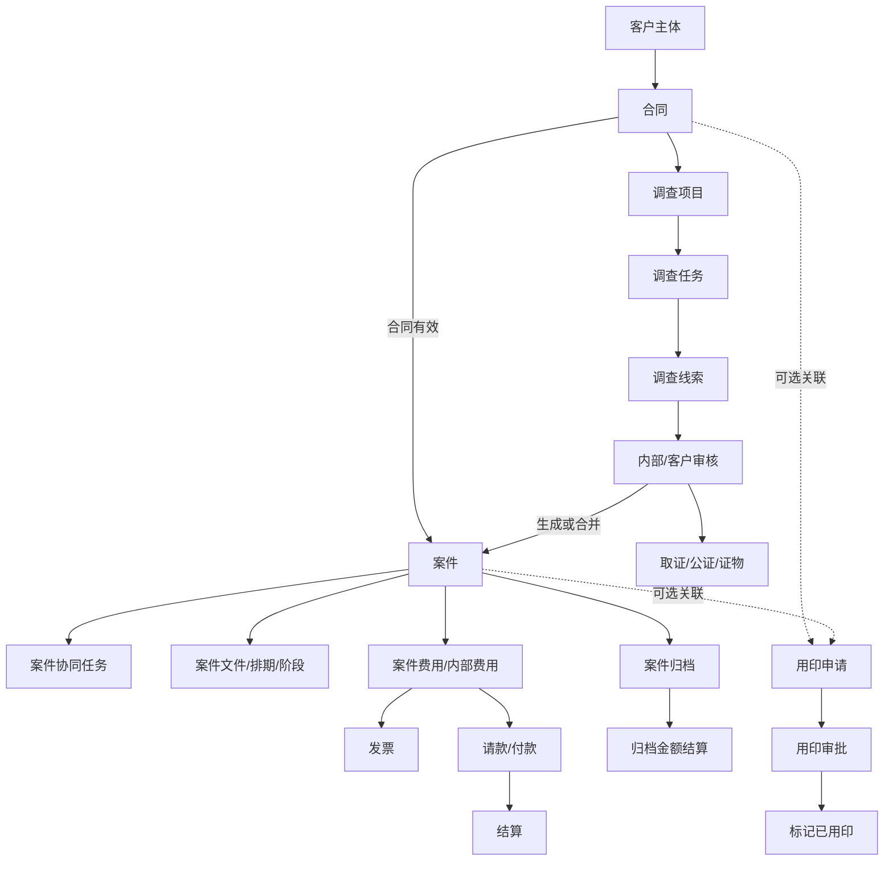
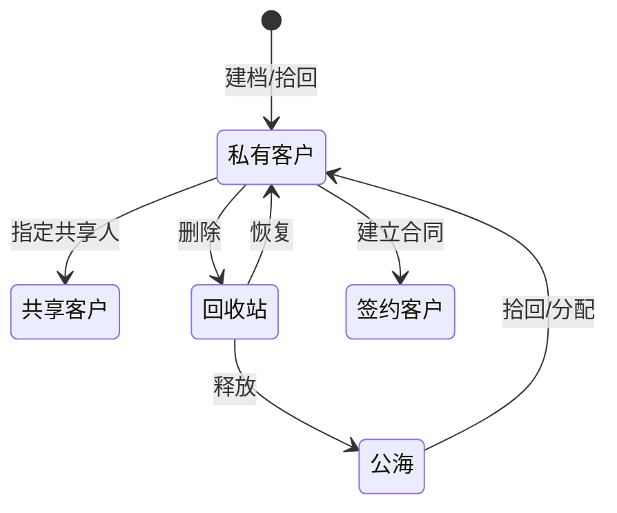
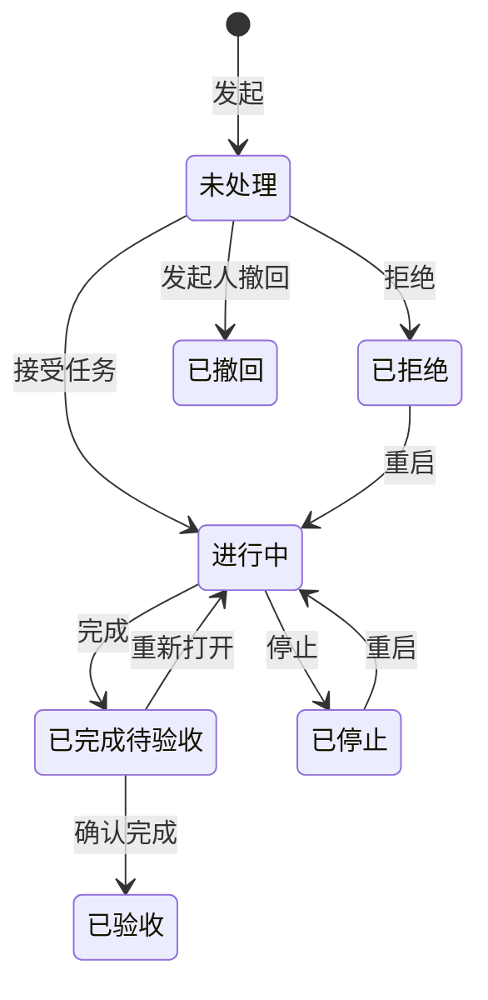

# 原 OA 系统业务逻辑推断报告

更新时间：2026-07-17

## 一、如何理解本报告

本报告把规则分成三级：

- **A级（直接证明）**：控制器判断、页面按钮、程序集方法、枚举或 SQL 明确存在。
- **B级（强推断）**：多个字段、状态分布和跨模块动作相互印证，但未取得完整服务方法源码。
- **C级（待验证）**：符合业务常识或当前重构规则，但原系统证据仍不完整。

结论：原系统的真正核心不是菜单，而是“业务对象 + 状态机 + 专用动作 + 权限范围 + 审计记录”。重构时如果只复制页面和表格，而没有复制这些约束，系统外观会相似，但业务会失真。

## 二、系统的业务主干

推断出的对象层级：

1. 客户是业务主体根节点。
2. 合同是商业授权和收费边界。
3. 案件是法律服务交付主对象。
4. 调查线索可以先于案件存在，经审核后再生成或并入案件。
5. 任务、文件、费用、用印都是围绕交付产生的受控子流程。
6. 归档和结算分别代表业务结束与财务结束，两者相关但不等同。

## 三、客户管理

### 推断出的生命周期

### 规则

| 规则 | 等级 | 依据 |
|---|---|---|
| 客户必须有唯一业务编号，编号按公司和年度序列生成 | A | `P_CRM_Customer_No_Create`、`CustomerNo` |
| 客户存在负责人、业务负责人、部门和公司四种组织归属字段 | A | `CustomerOwner`、`BusinessOwner`、`DepartmentId`、`CompanyId` |
| “删除”是业务停用/进入回收站，不应直接物理删除 | A | `CustomerDelete`、`CustomerRestore`、`IsActived` |
| 公海客户可被重新拾回 | A | `CustomerOpen`/`CustomerClose` 页面消息“拾回成功” |
| 客户共享不改变客户所有权，只增加只读或有限协作范围 | B | 独立共享表/控制器、`IsShared` 与 `CustomerOwner` 同时存在 |
| 最近联系和最近更新是投影视图，不是独立客户状态 | B | `LastContactTime`、`LastUpdateTime`、沟通记录与客户主表并存 |
| 利益冲突查询应跨客户与案件主体关系，不应仅做名称模糊搜索 | B | `CustomerSearching`、案件客户字段和最新案件展示 |

## 四、合同中心

### 生命周期

`草稿 → 待提交 → 审批中 → 审批通过/驳回 → 履行 → 归档`

### 直接规则

- 合同编号由公司简称、合同标识、年份和序列组成。（A）
- 合同必须属于客户，保存时同时保留 `CustomerId` 和 `CustomerNo`。（A）
- 合同提交审批后进入专用审核流程，审核记录不能由普通编辑接口替代。（A）
- 合同归档后不允许新建案件，原控制器明确返回“合同已归档，不允许新建案子”。（A）
- 合同同时存在内部合同号 `ContractNo` 和外部合同号 `RefContractNo`。（A）
- 开票时合同不存在或没有外部合同号，流程被拒绝。（A）

### 强推断

- `ContractMoney`、`ChargingType`、`TaxRate` 决定后续应收和发票计算方式。（B）
- 合同对象表代表同一合同可覆盖多个服务对象、案件或收费对象。（B）
- 合同变更不应覆盖原审批版本，`IsChanged`、审核轮次和合同事件说明需要版本化记录。（B）
- 案件创建应只允许使用“当前用户可见、有效、已审批、未归档”的合同。（B）

## 五、案件中心

### 建案来源

案件有两条主要入口：

1. 合同建案：验证合同和客户后创建。
2. 线索建案：调查线索审核后创建新案件或并入已有案件。

### 直接规则

| 规则 | 等级 |
|---|---|
| 未找到合同或客户时不能建案 | A |
| 已归档合同不能建案 | A |
| 线索已经生成过案件时不能重复生成 | A |
| 合并目标案件必须存在 | A |
| 两个案件的客户不一致时禁止合并 | A |
| 案件费用未到账时不能提交归档审核 | A |
| 案件归档包含内部审核和正式审核两层 | A |
| 归档拒绝后应回到可修正和重新提交状态 | B |

### 案件信息为什么拆成多个页面

案件表同时包含基本信息、当事人、公安机关、三级检察院、三级法院、执行法院、承办律师、结算、公证和执行阶段时间。由此推断原系统不是一次性录完案件，而是按阶段逐步补录：

1. 建案时先保存客户、合同、案件类型、权利类型和负责人。
2. 根据案件类型显示不同当事人及司法机关字段。
3. 分配案件律师、法院律师和助理。
4. 诉讼过程中持续维护一审、二审、再审或执行信息。
5. 结案时写入结案时间、归档类型和档案号。

刑事案件需要公安、检察院和法院；行政/国家赔偿主要使用法院信息；法律顾问案件使用顾问起止日期。这是由字段和页面分支共同支持的 B 级推断。

### 案件阶段与执行

案件阶段不是单一“进行中/完成”，而是由 `CaseTypeId + CasePhaseId` 组合决定。执行流程另有独立状态和每个执行阶段的开始/结束时间，因此重构应采用：

- 案件总体阶段；
- 执行子流程状态；
- 阶段历史记录；
- 当前截止日期/提醒日期。

不能只在案件表保存一个可随意修改的状态字符串。

## 六、协同任务

### 角色推断

- `Initiator`：发起人。
- `Officer`：当前负责人。
- `FirstOfficer`：最初负责人，用于追溯交接。
- `Associates`：协作人集合。
- Task Node：一次接收、转交或分工节点。

### 生命周期

### 规则

- 创建任务必须指定负责人。（A）
- 结束时间必须晚于开始时间。（A）
- 任务详情按钮按身份和状态展示接受、拒绝、完成、撤回、重启和确认完成。（A）
- 转交通过新增任务节点完成，而不是直接丢失原负责人。（B）
- 完成和验收是两个状态：负责人完成后，仍需发起人确认。（A）
- 程序集和数据访问层存在 `GetFinishedTaskListAfter5Days`，其 SQL 查询 `TaskStatus=3` 且完成时间超过指定天数的任务。（A）
- 上述查询强烈暗示完成后存在 5 天验收窗口或自动处理任务，但目前没有取得调用它的 Windows Service 主程序，不能仅凭该方法断言具体自动转换动作。（B）
- 当前重构必须保留“超过 30 天拒绝、交接后可重新开始、交接 5 天未开始自动完成”三条项目不变量；其中“重新开始”有原页面/服务直接证据，其余精确触发条件仍应继续补原服务证据。（C/A 混合）

## 七、调查、线索与证据

### 业务结构

调查项目不是案件附属表，而是可以由合同单独发起的工作项目：

`合同 → 调查项目 → 调查任务 → 调查线索 → 内部审核 → 客户审核 → 取证 → 证物/公证 → 案件`

### 规则

- 创建调查项目必须有合同。（A）
- 调查项目可以指定授权起止时间、调查范围、调查人和是否需要客户审核。（A）
- 线索存在内部审核人和客户审核人两套字段，说明两级审核可配置。（A）
- 审核线索时如果要求并案，目标案号必须存在。（A）
- 线索可生成新案件或合并已有案件，但不能重复生成。（A）
- 取证文件导入必须匹配现有线索；未匹配时拒绝。（A）
- 证据同时记录证据状态、领取状态、仓库号、库位号、公证机构和公证书号。（A）
- 证物生命周期必须与普通附件分开，不能用文件删除代替出入库和销毁。（B）

### 审核状态的业务含义

线索大量分布在“审核拒绝”和“已取证”，说明审核不是形式步骤，而是筛除无效线索的核心质量闸门。客户审核不是每条线索必经，受调查项目的 `NeedToAuditOnCustomer` 控制。（B）

## 八、用印管理

用印是独立模块，不属于调查模块。

### 独立性的证据

- 独立主表、审核表、文件表。
- 独立申请编号和申请日期。
- 独立审核轮次、审核节点、审核人和审核意见。
- 独立印章类型、电子章、线下打印、打印份数、打印人和打印时间。
- 可以按合同或案件发起，但 `ContractNo`、`CaseNo` 都是可选关联字段。

### 推断流程

`申请草稿 → 提交审核 → 审核通过 → 待用印 → 标记已用印`

旁路状态为审核拒绝、撤回和终止。上传盖章后文件应产生新附件记录，不应覆盖申请前原文件。（B）

数据中已用印 786 条、撤回 678 条，说明撤回是高频正常流程，重构必须支持并记录撤回原因和操作者，而不是简单删除申请。（B）

## 九、财务中心

### 财务存在四套不同概念

1. **应收/回款**：客户实际付款及银行流水。
2. **案件费用**：归属于案件的官费、代理费和其他费用。
3. **内部费用/应付**：律所对员工或供应商的请款与付款。
4. **发票/结算**：对外开票和内部收益分配。

不能把它们合并成一张通用“费用记录”表。

### 直接规则

- 发票实际开票金额为零时不能提交。（A）
- 发票关联的合同必须存在且必须有外部合同号。（A）
- 发票申请可以撤回，已开票记录可以作废，但两者是不同动作和状态。（A）
- 内部请款有提交、审批、付款打包、核销、撤销和回滚。（A）
- 结算存在待结算、待审核、待付款、已付款、拒绝和回退。（A）
- 同一回款存在多个案件分配时，普通业务人员不能直接提交，必须联系财务处理。（A）
- 案件费用未到账会阻断案件归档。（A）

### 强推断

- 回款先进入总金额，再通过 `FAM_AR_Payment_Object` 分配到案件和费用明细。（B）
- 结算必须以分配后的金额为准，不能直接以银行回款总额计算。（B）
- `CaseOfficeFee`、`CaseCommissionFee`、`CaseNonOfficeFee` 分别代表官费、代理费和其他费用，结算比例可能不同。（B）
- 归档金额结算与一般回款结算是两个状态机，前者在案件归档后处理。（B）
- 数据访问层存在“超过 30 天未分配回款”查询，说明系统有财务超期提醒或待办。（A/B）

## 十、文件、仓库和审计

### 文件

客户、合同、案件、任务、调查、线索、证据、发票和用印均有独立文件控制器或文件表。推断文件必须记录：

- 所属业务类型和业务编号；
- 文件类型；
- 原始文件名、大小和存储路径；
- 上传人和上传时间；
- 是否有效；
- 版本或盖章后文件关系。

附件不是通用无归属文件池。

### 仓库和证物

证物除了附件内容还具有实物库存状态。仓库、库位、入库、领取、出库、重新入库和销毁必须形成不可逆审计链。（B）

### 日志

`SYS_Log` 约 4.41 亿行，说明原系统大量记录操作或系统事件。重构应区分：

- 业务审计日志：必须长期保留、可按业务编号检索；
- 技术运行日志：按时间归档和清理；
- 敏感数据访问日志：记录谁查看或下载了什么。

不能把三者继续混在一个无限增长的大表中。（B）

## 十一、权限模型推断

权限至少由五层共同决定：

1. 账号是否启用。
2. 角色是否拥有菜单/页面权限。
3. 部门和公司范围。
4. 记录级关系：负责人、经办人、协作人、审核人、共享人。
5. 当前业务状态是否允许该动作。

因此，按钮是否显示只是表现层；后端每个动作都必须重新验证权限和状态。

`admin` 是最高权限，应拥有全部菜单、全所数据和全部字段。管理员可见范围不能被普通角色配置、旧登录会话或前端缓存降低。

## 十二、应如何落到重构系统

### 聚合根建议

- Customer：客户、联系人、沟通、共享和回收生命周期。
- Contract：合同版本、对象、文件、审批和归档。
- Case：案件、当事人、司法机关、律师、阶段、排期、文件和归档。
- Task：任务、节点、消息、附件和交接。
- Investigation：项目、任务、线索、审核、证据和证物。
- OfficialDocument：用印申请、审核、附件和用印结果。
- Finance：应收、回款分配、案件费用、内部请款、发票和结算。

### 专用命令建议

不要提供任意状态修改接口，应提供语义化命令，例如：

- `submit_contract`、`approve_contract`、`archive_contract`
- `create_case_from_contract`、`create_case_from_clue`、`merge_cases`
- `accept_task`、`handoff_task`、`finish_task`、`verify_task`、`reopen_task`
- `submit_clue`、`approve_clue`、`capture_evidence`、`move_evidence`
- `submit_seal_request`、`approve_seal_request`、`mark_stamped`
- `apply_invoice`、`void_invoice`、`allocate_receipt`、`submit_settlement`、`mark_paid`
- `submit_case_archive`、`approve_case_archive`

每个命令应在同一事务中完成状态校验、权限校验、数据写入和审计记录。

## 十三、还需继续验证的高风险点

1. 任务“交接 5 天未开始自动完成”的准确状态条件、定时频率和操作者记录。
2. 任务最大 30 天规则在原服务中的准确判断基准。
3. 每种案件类型的必填当事人和司法机关字段。
4. 合同金额、收费方式与应收生成的精确公式。
5. 代理费结算、归档费和绩效金额的精确比例。
6. 各角色在页面、字段、导出、下载和审批上的完整矩阵。
7. 用印撤回、终止和已用印后的文件版本规则。
8. 证物销毁是否需要额外审批及双人确认。

这些项目在取得服务主程序、非空页面样本或合法只读业务记录后，应补为 A 级证据；验证前不能凭推断写死。

